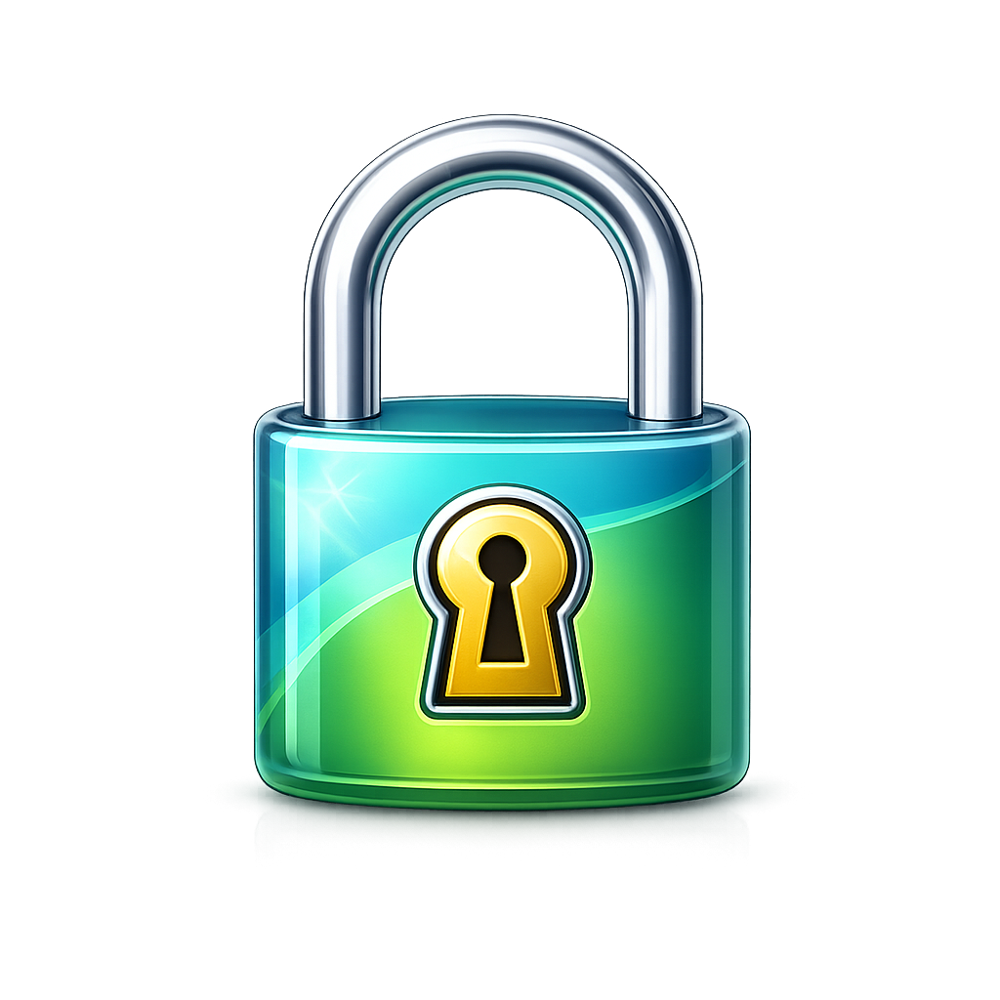
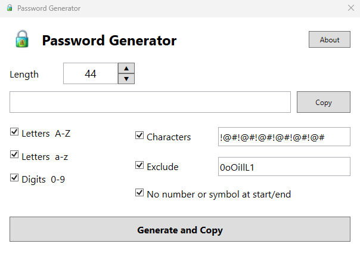

# PasswordGenerator

A lightweight Windows password generator built with WPF and .NET 8.



## Features

- Generate secure random passwords
- Adjustable password length
- Include:
  - Uppercase letters
  - Lowercase letters
  - Digits
  - Custom symbols
- Exclude confusing characters
- Prevent passwords from starting or ending with symbols/numbers
- Automatically remembers settings
- Standalone Windows executable
- Lightweight and fast

---

## Screenshot



---

## Requirements

- Windows 10 or Windows 11

No .NET runtime installation required when using published release builds.

---

## Build

Open in:

```text
Visual Studio 2022
```

Framework:

```text
.NET 8
WPF
```

---

## Publish

Recommended publish settings:

```text
Configuration: Release
Deployment Mode: Self-Contained
Target Runtime: win-x64
Produce Single File: Enabled
```

---

## License

Open source under the MIT License.

---

## Disclaimer

This software is provided as-is without warranty of any kind.

Use at your own risk.

ERPCreations LLC assumes no liability for damages, loss of data, security issues, or misuse resulting from the use of this software.

---

## Author

ERPCreations LLC